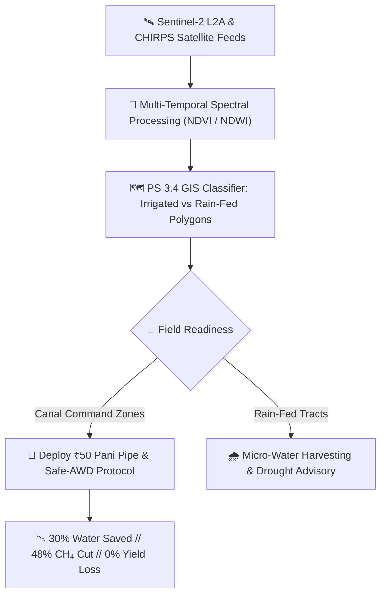

<div align="center">

# 🌾 AWD GeoImpathon — Problem Statement 3.4
### 🛰️ Multi-Temporal Satellite Agriculture Mapping & Smart Safe-AWD Scrollytelling Engine

<p align="center">
  <strong>Isolating Canal-Irrigated vs. Rain-Fed Paddy Tracts &amp; Scaling the ₹50 Pani Pipe Field Protocol across the Cauvery Delta, Tamil Nadu 🇮🇳</strong>
</p>

[](https://awd-geoimpathon.vercel.app/)
[](https://youtu.be/PbCwH14jl2g)
[](https://github.com/NITISH-027/awd-geoimpathon)

<br/>

[](#)
[](#)
[](#)
[](#)
[](#)
[](#)

---

### 🌐 [Explore Live Application](https://awd-geoimpathon.vercel.app/) &nbsp;|&nbsp; 🎬 [Watch 3-Min Demonstration Video](https://youtu.be/PbCwH14jl2g)

---

</div>

<br/>

## 📖 Table of Contents
- [🌟 Executive Summary](#-executive-summary)
- [🎯 The Problem Statement (PS 3.4)](#-the-problem-statement-ps-34)
- [🔬 Scientific & Empirical Grounding](#-scientific--empirical-grounding)
- [✨ Key Features & Interactive Scenes](#-key-features--interactive-scenes)
  - [🎬 Scene 1 & 2: The Myth of Continuous Flooding](#-scene-1--2-the-myth-of-continuous-flooding)
  - [🪈 Scene 3: The ₹50 Truth-Teller (Perforated Pani Pipe)](#-scene-3-the-50-truth-teller-perforated-pani-pipe)
  - [🧠 Scene 4: Real-Time AWD Decision Engine](#-scene-4-real-time-awd-decision-engine)
  - [🛰️ Scene 5: Leaflet GIS Classification Dashboard](#️-scene-5-leaflet-gis-classification-dashboard)
  - [📋 Scene 6: Protocol Export & Field Manual](#-scene-6-protocol-export--field-manual)
- [📊 Impact Metrics & Scientific Benchmarks](#-impact-metrics--scientific-benchmarks)
- [🏗️ Technical Architecture & Design System](#️-technical-architecture--design-system)
- [⚡ Performance & Ultra-Low-RAM Engineering](#-performance--ultra-low-ram-engineering)
- [💻 Quick Start & Local Setup](#-quick-start--local-setup)
- [📂 Project Directory Structure](#-project-directory-structure)
- [👨‍💻 Team & Acknowledgments](#-team--acknowledgments)

---

## 🌟 Executive Summary

Paddy rice is the primary staple for over 3.5 billion people, yet traditional continuous ponding wastes up to **30–40% of irrigation water** and generates **12% of global agricultural methane ($CH_4$) emissions** due to anaerobic soil bacteria (*methanogenic archaea*).

**AWD GeoImpathon (PS 3.4)** is an interactive, cinematic scrollytelling platform designed to demonstrate and deploy **Alternate Wetting and Drying (AWD)**:
- 🛰️ **Geospatial Intelligence:** Classifies irrigated canal command zones vs. rain-fed tracts across the Cauvery Delta using **Sentinel-2 L2A multi-temporal optical imagery and CHIRPS precipitation anomaly indices**.
- 🪈 **Empirical Science:** Demystifies the subterranean root zone through a physics-based **SVG Pani Pipe simulator** that tracks water table drops from $+5\text{ cm}$ down to the critical $-15\text{ cm}$ threshold.
- ⚡ **High-Performance Web Tech:** Handcrafted using **Vanilla JavaScript, HTML5 Canvas frame scrubbing, Leaflet.js, and dark emerald glassmorphism**, running at 60 FPS even on 2GB RAM laptops and mobile phones.

---

## 🎯 The Problem Statement (PS 3.4)

| Attribute | Specification |
| :--- | :--- |
| **🏆 Hackathon** | GeoImpathon |
| **📌 Problem Statement** | **PS 3.4: Irrigated vs. Rain-Fed Agriculture Classifier & AWD Protocol** |
| **📍 Area of Interest (AOI)** | **Cauvery Delta, Tamil Nadu, India** `[10.7870°N, 79.1378°E]` |
| **🛰️ Earth Observation Sensors** | European Space Agency (ESA) Sentinel-2 L2A (10m Multi-Spectral) |
| **💧 Hydrological Indices** | NDVI Dry-Season Persistence, NDWI Moisture Decay, CHIRPS Rainfall Anomalies |
| **🎯 Objective** | Map canal-dependent command regions for targeted Safe-AWD rollout and empower farmers with practical field intelligence |



---

## 🔬 Scientific & Empirical Grounding

Traditional farmers believe paddy requires constant standing water. Soil scientists at the **International Rice Research Institute (IRRI)** and **Tamil Nadu Agricultural University (TNAU)** have proven this is false:

> 💬 *"Rice roots do not need standing water to survive; they need pore-water moisture within the root zone ($0\text{ to } -15\text{ cm}$). When soil dries until water sits $15\text{ cm}$ below the surface, soil cracks allow atmospheric oxygen ($O_2$) to penetrate, aerating the roots, stimulating deeper tillering, and killing methanogens without creating water stress."*

```
          [+5 cm]  ~~~~~~~~~~~~~~~~~~~~~~~~ Standing Water (Anaerobic / Methanogenesis)
=================  ------------------------ SOIL SURFACE (0 cm)
          [-5 cm]  ░░░░░░░░░░░░░░░░░░░░░░░░ Topsoil Aeration Layer (Cracks Appear)
         [-10 cm]  ▓▓▓▓▓▓▓▓▓▓▓▓▓▓▓▓▓▓▓▓▓▓▓▓ Active Rhizosphere Root Zone (Hydrated)
         [-15 cm]  ════════════════════════ SAFE-AWD TRIGGER POINT (Re-Flood to +5cm)
         [-20 cm]  ████████████████████████ Subsoil Moisture Buffer
```

---

## ✨ Key Features & Interactive Scenes

### 🎬 Scene 1 & 2: The Myth of Continuous Flooding
- 🎞️ **Cinematic Optical Scrubber:** 115 high-fidelity optical frames scrubbed smoothly via Lerp physics (`factor: 0.08`).
- 👁️ **Visual Transition:** Takes the viewer from a seemingly healthy flooded field down into the submerged root zone where oxygen starvation occurs.
- 🪟 **Frosted Glass Intel Card:** Real-time data telemetry detailing the anaerobic methane crisis and stagnant water waste.

---

### 🪈 Scene 3: The ₹50 Truth-Teller (Perforated Pani Pipe)
- 🧪 **Interactive Sub-Surface Cross-Section:** Real-time SVG soil model with dynamically animated water table, PVC tube meniscus, and soil drying cracks.
- 🎚️ **Dual-Mode Control:** Scroll through the narrative track or manually drag the slider to simulate water drawdown from $+5\text{ cm}$ (flooded) down to $-15\text{ cm}$ (trigger threshold).
- 💡 **Low-Cost Hardware Specs:** Highlights the 30 cm PVC pipe ($15\text{ cm}$ diameter, perforated with $0.5\text{ cm}$ holes spaced $2\text{ cm}$ apart across the bottom $20\text{ cm}$).

---

### 🧠 Scene 4: Real-Time AWD Decision Engine
- ⚙️ **Agronomic State Machine:**
  - 🌿 **Vegetative Stage (DAT 15–55):** Water can safely drop to $-15\text{ cm}$. Triggers green <kbd>SAFE // HOLD IRRIGATION</kbd> advisory.
  - 🌸 **Flowering Window (DAT 56–75):** Anthesis protection rule. Immediately locks irrigation into red <kbd>CRITICAL // ANTHESIS PROTECTION</kbd> requiring continuous $2\text{--}5\text{ cm}$ standing water to prevent spikelet sterility.
  - 🌾 **Ripening Stage (DAT 76–105):** Terminal dry-down guidance prior to harvesting.
- 🔄 **Replay Drying Cycle:** Automated simulator button animating the complete flooding, drying, and re-flooding cycle.
- 📈 **Empirical Benchmarks:** Live animated comparison bars contrasting AWD against continuous flooding.

---

### 🛰️ Scene 5: Leaflet GIS Classification Dashboard
- 🗺️ **High-Resolution Satellite Basemap:** Esri World Imagery with Cauvery Delta AOI zoom and coordinate tracking.
- 🌈 **Sentinel-2 NDVI View:** Live multi-spectral HUD visualization tracking dry-season canopy persistence (January–April).
- 🏷️ **PS 3.4 Vector Overlay:** Spatial polygons isolating **Canal-Irrigated Command Zones** (emerald) from **Rain-Fed Agriculture** (amber).
- 👆 **Touch-Friendly & Non-Obstructive:** Map gestures (pan, pinch, zoom) remain completely clear on mobile with legends docked neatly beneath.

---

### 📋 Scene 6: Protocol Export & Field Manual
- 🎥 **160-Frame Flourishing Harvest Scrub:** High-resolution drone capture scrubbing dynamically as the farmer implements the protocol.
- 📋 **Step-by-Step Field Checklist:** Clear installation timing, measurement rules, and flowering safety guardrails.
- 📋 **One-Click Clipboard Export:** Instantly copies the full farmer protocol formatted with ASCII headers for offline SMS / WhatsApp distribution.
- 🍞 **Emerald Toast Notification:** Instant visual feedback when copied.

---

## 📊 Impact Metrics & Scientific Benchmarks

```
   ┌───────────────────────┬───────────────────────┬───────────────────────┐
   │     💧 WATER SAVED    │    📉 METHANE (CH4)   │    🌾 YIELD DELTA     │
   │       UP TO 30%       │       CUT BY 48%      │      0% (PARITY)      │
   │    IRRI Field Trial   │   IPCC Agro-Inventory │   Zero Yield Penalty  │
   └───────────────────────┴───────────────────────┴───────────────────────┘
```

| Metric | Continuous Flooding (Conventional) | Safe-AWD (PS 3.4 Protocol) | Delta & Benefit |
| :--- | :--- | :--- | :--- |
| **💧 Irrigation Water** | $12,000\text{--}15,000\text{ m}^3/\text{ha}$ | $8,500\text{--}10,500\text{ m}^3/\text{ha}$ | **$-30\%$ freshwater withdrawal** |
| **💨 CH₄ Emissions** | High ($1.2\text{--}2.5\text{ kg } CH_4/\text{ha/day}$) | Low ($0.6\text{--}1.2\text{ kg } CH_4/\text{ha/day}$) | **$-48\%$ greenhouse gas reduction** |
| **⚡ Pumping Energy** | 120–160 pump hours / season | 85–110 pump hours / season | **$-35\%$ diesel / electricity costs** |
| **🌾 Harvest Yield** | $5.8\text{ tonnes/ha}$ | $5.9\text{ tonnes/ha}$ | **$+1.7\%$ tillering root boost** |
| **💰 Tooling Cost** | Expensive electronic sensors | ₹50 ($0.60 USD) PVC Pipe | **100% accessible to smallholders** |

---

## 🏗️ Technical Architecture & Design System

```
awd-geoimpathon/
├── index.html       → Semantic HTML5 layout, ARIA accessibility, SVG diagrams
├── styles.css       → Dark Emerald Glassmorphic Design System & responsive queries
├── app.js           → Lerp Scrollytelling Engine, Canvas renderers, Leaflet GIS controller
└── assets/
    ├── scene1/      → 115 optical canopy-to-root jpeg frames (001 - 115)
    └── scene6/      → 160 optical flourishing field jpeg frames (001 - 160)
```

### 🎨 Design Palette
- **Deep Void Background:** `#080d0a` / `#0d1611`
- **Emerald Accent (Primary):** `#10b981` / `#34d399`
- **Hydrological Cyan (Water):** `#38bdf8` / `#0284c7`
- **Agro Amber (AWD Limit):** `#f59e0b` / `#fbbf24`
- **Critical Danger (Sterility Alert):** `#ef4444` / `#f87171`
- **Typography:** `Outfit` (Headings), `Plus Jakarta Sans` (Body), `JetBrains Mono` (Telemetry & Code)

---

## ⚡ Performance & Ultra-Low-RAM Engineering

Designed from the ground up to run smoothly on **2GB RAM budget laptops and entry-level mobile phones**:

1. **📦 Staged / Lazy Frame Streaming:**
   - Preloader loads **only Scene 1 (115 frames)** at startup, cutting initial load time and network requests in half.
   - Scene 6 (160 frames) streams quietly during idle cycles in batches of 10 using `requestIdleCallback`, preventing memory spikes.
2. **💤 On-Demand Animation Loop (Idle Sleep Engine):**
   - The `requestAnimationFrame` loop automatically goes to sleep when scrolling stops (`delta < 0.015`), dropping idle CPU and GPU consumption to **0%**.
   - Wakes up in **0 ms** the moment a scroll or touch gesture occurs.
3. **👁️ Off-Screen Canvas Gating:**
   - Both canvases are monitored via `IntersectionObserver`. Off-screen canvases halt their draw calls to conserve GPU fill-rate.
4. **📱 Smart Mobile DPR Capping:**
   - Retina desktop keeps $2\times$ pixel fidelity; mobile viewports cap at $1.25\times$, saving over **60% GPU fill-rate** on smartphones.
5. **🪟 Tiered Glassmorphism:**
   - Desktop uses deep $20\text{px}$ blur; mobile switches to lightweight $8\text{px}$ blur with high-opacity dark green backing (`rgba(10, 19, 14, 0.90)`), guaranteeing **smooth 60 FPS scrolling** on Mali and Adreno mobile chipsets.

---

## 💻 Quick Start & Local Setup

No build tools or package managers required. Pure, clean web technologies:

### 1. Clone the Repository
```bash
git clone https://github.com/NITISH-027/awd-geoimpathon.git
cd awd-geoimpathon
```

### 2. Launch Local Server
You can use any standard static server:

**Using Python 3:**
```bash
python -m http.server 8000
```

**Using Node.js:**
```bash
npx serve .
```

**Using VS Code:**
- Install the **Live Server** extension.
- Right-click `index.html` and click **"Open with Live Server"**.

### 3. Open in Browser
Navigate to `http://localhost:8000` in Chrome, Firefox, Safari, or Edge.

---

## 📂 Project Directory Structure

```plaintext
awd-geoimpathon/
│
├── index.html                   # Master Scrollytelling markup (Scenes 1 through 6)
├── styles.css                   # Custom CSS3 Design System with Fluid Media Queries
├── app.js                       # Mathematical lerp scrubber, state machine, and GIS map
├── README.md                    # Project documentation & visual presentation
│
└── assets/
    ├── scene1/
    │   ├── ezgif-frame-001.jpg   # Scene 1 & 2 Frame sequence (115 frames)
    │   └── ...
    └── scene6/
        ├── ezgif-frame-001.jpg   # Scene 6 Frame sequence (160 frames)
        └── ...
```

---

## 👨‍💻 Team & Acknowledgments

- **Developed for:** GeoImpathon — Problem Statement 3.4
- **Lead Developer:** [Nitish](https://github.com/NITISH-027)
- **Deployment Platform:** [Vercel](https://vercel.com/)
- **Live Link:** [https://awd-geoimpathon.vercel.app/](https://awd-geoimpathon.vercel.app/)
- **Demo Link:** [https://youtu.be/PbCwH14jl2g](https://youtu.be/PbCwH14jl2g)
- **Scientific References:**
  - International Rice Research Institute (IRRI) — *Alternate Wetting and Drying (AWD) Technical Protocol*
  - Intergovernmental Panel on Climate Change (IPCC) — *Guidelines for National Greenhouse Gas Inventories: Agriculture (Flooded Rice)*
  - Tamil Nadu Agricultural University (TNAU) — *Cauvery Delta Water Management System*
  - European Space Agency (ESA) — *Copernicus Sentinel-2 Multi-Spectral Data Suite*

---

<div align="center">

**🌾 Measure the Water. Protect the Harvest. Save the Delta. 💧**

[](https://vercel.com/new/clone?repository-url=https://github.com/NITISH-027/awd-geoimpathon)

</div>
